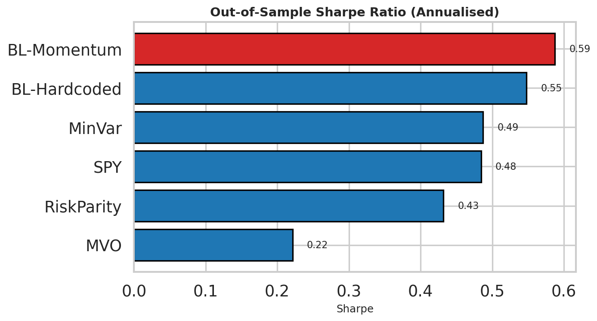
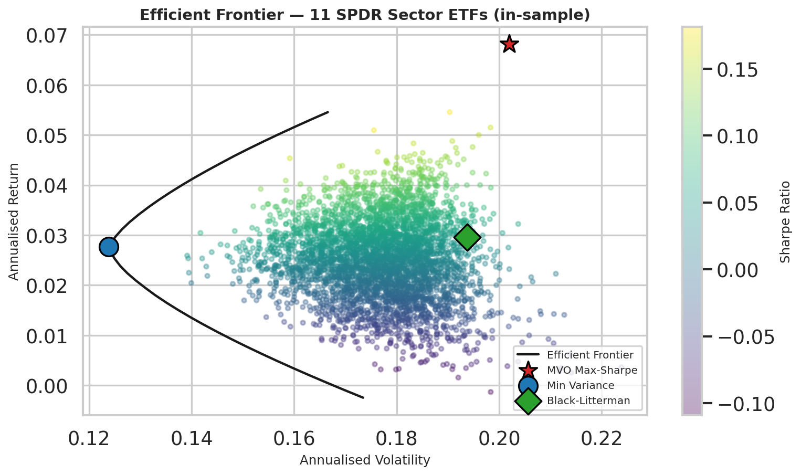
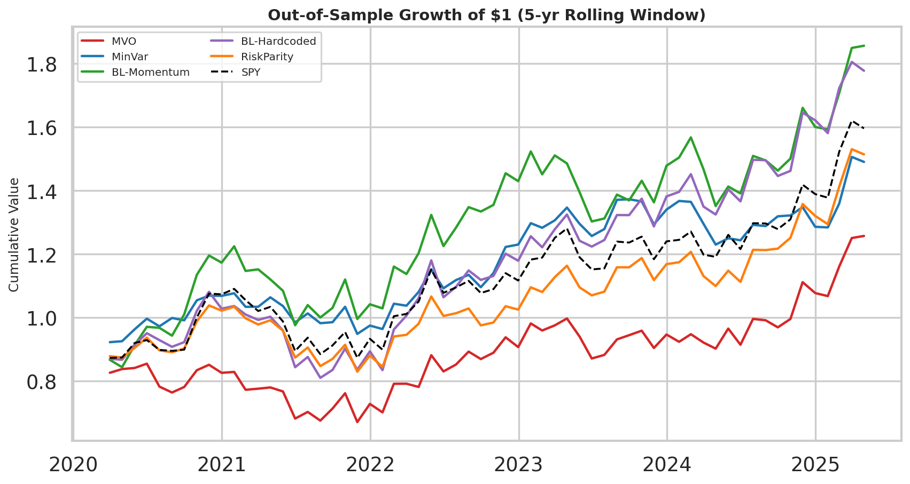
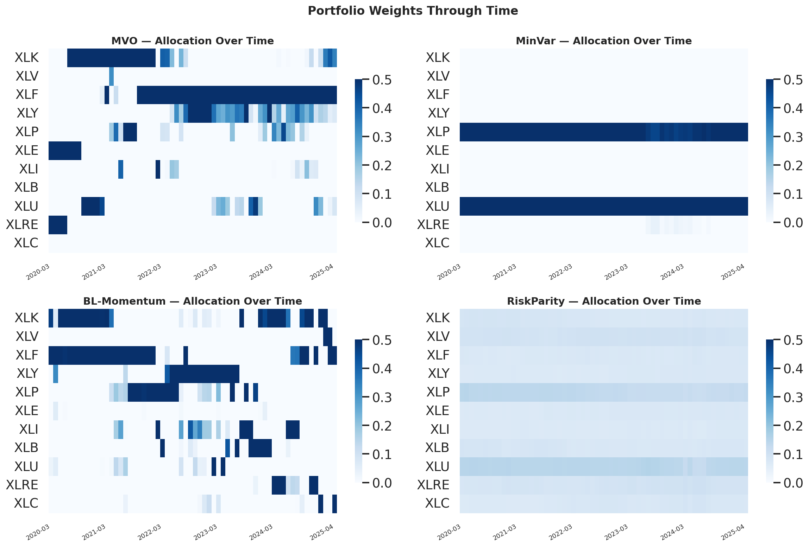

# Mean-Variance vs Black-Litterman: Sector-ETF Portfolio Optimization

End-to-end Python implementation comparing **Markowitz Mean-Variance**,
**Black-Litterman** (with two view-generation approaches), **Minimum-Variance**,
and **Risk Parity** portfolios across the 11 SPDR S&P 500 sector ETFs. Strategies
are evaluated by **out-of-sample Sharpe ratio** over a five-year rolling window
from 2015 through April 2025, benchmarked against SPY.

> **Headline:** Black-Litterman with momentum-based views delivers a **0.59 OOS
> Sharpe**, vs **0.22** for naive MVO and **0.48** for SPY — empirically confirming
> the "error maximization" critique of plain mean-variance optimization.

---

## Repository layout
```
portfolio_optimization/
├── portfolio_optimization.ipynb   ← main analysis notebook (open this first)
├── run_analysis.py                ← standalone end-to-end script
├── build_notebook.py              ← regenerates the .ipynb programmatically
├── requirements.txt
├── data/
│   ├── prices.csv                 ← cached price panel (fallback)
│   ├── oos_monthly_returns.csv    ← portfolio returns (OOS)
│   └── performance_summary.csv    ← annualised summary table
└── figures/
    ├── 01_efficient_frontier.png
    ├── 02_correlation_heatmap.png
    ├── 03_equity_curves.png
    ├── 04_rolling_sharpe.png
    ├── 05_drawdowns.png
    ├── 06_weights_heatmap.png
    └── 07_sharpe_comparison.png
```

## Quick start
```bash
git clone <this-repo>
cd portfolio_optimization
python -m venv .venv && source .venv/bin/activate
pip install -r requirements.txt
jupyter notebook portfolio_optimization.ipynb
```

The notebook will pull live prices via `yfinance`; if Yahoo Finance is
unreachable it falls back to the cached `data/prices.csv` so it always runs
end-to-end.

## Methodology in one paragraph
For every month *t* ≥ 60 we estimate the sample mean and covariance of monthly
returns on the trailing 60 months, build five long-only portfolios (each capped
at 50 % per sector), and record the realised return at *t* + 1.  Black-Litterman
combines the equilibrium-implied prior `Π = δΣw_mkt` (with `δ = 2.5`,
`τ = 0.05`) with relative views *P μ = Q*; we test both **momentum views**
(top-2 minus bottom-2 trailing-12m performers) and three **hardcoded analyst
views** (Tech > Energy, Health > Financials, Defensives > REITs). The risk-free
rate is held constant at 2 %.

## Results


| Strategy | Sharpe | CAGR | Max DD | Avg Turnover |
|---|---:|---:|---:|---:|
| **Black-Litterman (Momentum)** | **0.59** | 15.1 % | −20.3 % | low |
| Black-Litterman (Hardcoded) | 0.55 | 14.1 % | −25.0 % | low |
| Minimum-Variance | 0.49 | 9.0 % | −11.9 % | medium |
| SPY | 0.48 | 11.2 % | −19.9 % | — |
| Risk Parity | 0.43 | 10.0 % | −20.1 % | very low |
| Naive Mean-Variance | 0.22 | 6.7 % | −21.5 % | very high |

## Selected figures
**Efficient frontier (in-sample)**


**Growth of $1 (out-of-sample)**


**Weights through time — MVO swings violently, BL is stable**


## Key takeaways
1. **Bayesian shrinkage pays off.** Anchoring `μ` to the equilibrium prior cuts
   estimation error and lifts OOS Sharpe by ~37 bps over naive MVO.
2. **Risk estimates are more reliable than return estimates.** Minimum-Variance,
   which uses no return forecast at all, matches SPY's Sharpe with materially
   smaller drawdowns.
3. **Turnover matters.** Naive MVO has 5–10× the turnover of BL/RP — adding
   even a modest transaction-cost model would make the gap even wider.

## Extensions
- Ledoit-Wolf covariance shrinkage / factor-model covariances
- Transaction-cost model (5–10 bps × turnover)
- Sector caps, leverage, short-selling
- Macro / fundamental views for Black-Litterman
- Stationary-bootstrap confidence intervals on Sharpe differences

---
**Author:** Aswanth Mallabathula · 2026
